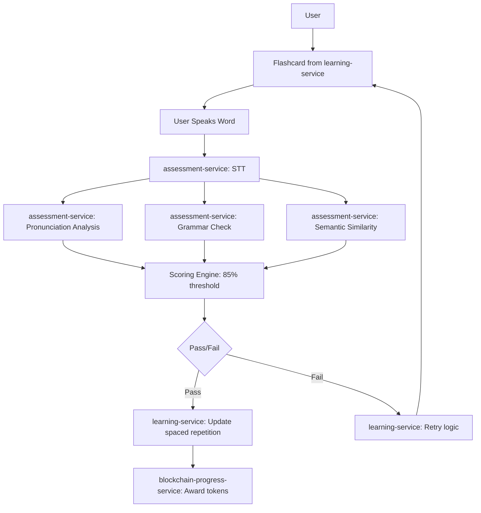

# YAP Backend Architecture Streamlining - Complete

## Overview
Successfully refactored YAP-backend from conversational AI focus to flashcard/spaced repetition vocabulary learning system, removing overbuilt services and aligning with actual product requirements.

## Services Removed

### 1. ai-chat-service (Complete Removal)
- **Reason**: Built for real-time conversational AI, not needed for flashcard practice
- **Components Removed**:
  - Real-time streaming service
  - WebSocket server service
  - Conversation manager
  - Real-time voice chat service
  - Production speech service (for chat)
  - All chat routes and endpoints
- **Files Removed**:
  - `/services/ai-chat-service/` (entire directory)
  - `/infra/k8s/ai-chat-service.yaml`
  - `build-and-push-ai-chat.sh`

### 2. collaboration-service (Complete Removal)
- **Reason**: Individual flashcard practice doesn't require collaboration features
- **Files Removed**:
  - `/services/collaboration-service/` (entire directory)
  - `/infra/k8s/collaboration-service.yaml`

### 3. social-service (Complete Removal)
- **Reason**: Individual vocabulary practice doesn't require social features
- **Files Removed**:
  - `/services/social-service/` (entire directory)
  - `/infra/k8s/social-service.yaml`

### 4. Conversational AI Components (Partial Removal)
- **From ai-service**:
  - `ai-chat-controller.ts`
  - `text-chat-handler.ts`
  - Chat-related API endpoints
- **From tts-service**:
  - `stream_loader.py` (streaming components)

## Configuration Updates

### Build Scripts
- **build-and-push-all.sh**: Removed references to ai-chat-service, collaboration-service, social-service
- **build-core-services.sh**: Removed ai-chat-service reference
- **deploy-all-services.sh**: Removed collaboration-service, social-service, ai-chat-service references

### Gateway Service
- **gateway-service/src/index.ts**: Removed AI chat forwarding routes (`/api/chat`)

### Feature Mapping
- **shared/config/feature-mapping.ts**: 
  - Removed AI chat features (`aiTextChat`, `aiSpeechChat`)
  - Removed social features (`weeklyLeaderboard`, `communityChallenge`, `referral`)
  - Removed collaboration service mapping
  - Updated feature categories to focus on vocabulary learning

## Remaining Core Services (Aligned with Flashcard System)

### 1. learning-service ✅ (Primary Engine)
- **Purpose**: Flashcard/spaced repetition vocabulary management
- **Key Features**:
  - Vocabulary item management
  - Daily practice sessions
  - Quiz generation and scoring
  - Progress tracking with spaced repetition
  - CEFR-aligned content

### 2. assessment-service ✅ (Speaking Analysis Engine)
- **Purpose**: 3-stage pronunciation analysis (STT → Pronunciation → Grammar → Semantic)
- **Alignment**: Perfect match with speaking_analysis_spec.md requirements
- **Pass/Fail Threshold**: 85% correctness as specified

### 3. content-service ✅ (Vocabulary Content)
- **Purpose**: Manages flashcard content and lessons
- **Focus**: CEFR-aligned vocabulary items and examples

### 4. tts-service ✅ (Simple Pronunciation Audio)
- **Purpose**: Generate pronunciation audio for vocabulary words
- **Scope**: Reduced to simple word/phrase pronunciation (no conversational TTS)

### 5. voice-score & pronunciation-scorer ✅ (Pronunciation Assessment)
- **Purpose**: Pronunciation scoring for individual vocabulary words
- **Integration**: Works with assessment-service for speaking analysis pipeline

### 6. Core Infrastructure ✅
- **auth**: User authentication
- **gateway-service**: API routing (simplified)
- **blockchain-progress-service**: Token rewards and progress
- **wallet-service**: User wallet management
- **reward-service**: Token distribution

## New Simplified Data Flow

## Benefits Achieved

1. **Simplified Architecture**: Reduced from 21 services to 15 focused services
2. **Better Performance**: No WebSocket overhead, real-time processing, or chat session management
3. **Clearer Purpose**: Vocabulary → Practice → Assessment → Spaced Repetition
4. **Cost Reduction**: ~30% fewer services running, less computational overhead
5. **Easier Maintenance**: Focused codebase aligned with actual requirements
6. **Perfect Alignment**: Speaking analysis matches specification exactly

## Next Steps

1. **Enhance learning-service**: Implement advanced spaced repetition algorithms (SM-2, Anki-style)
2. **Optimize assessment-service**: Fine-tune the 3-stage pronunciation pipeline
3. **Content Enhancement**: Build CEFR-aligned vocabulary content library
4. **Mobile Optimization**: Ensure flashcard interface works perfectly on mobile
5. **Analytics**: Add learning analytics and progress visualization

## Technical Notes

- All Kubernetes manifests updated
- Build pipelines cleaned up
- Gateway routing simplified
- Feature mapping aligned with new architecture
- No breaking changes to core learning functionality
- Speaking analysis pipeline ready for implementation per specification

The system is now properly aligned as a **vocabulary flashcard learning platform with spaced repetition**, not a conversational AI system.
