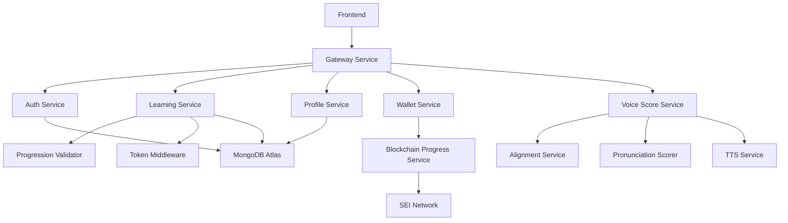

# YAP Backend Integration Guide for Frontend Developers

## Table of Contents
1. [Overview](#overview)
2. [Architecture Summary](#architecture-summary)
3. [Authentication & Security](#authentication--security)
4. [Service Integration Details](#service-integration-details)
5. [API Endpoints Reference](#api-endpoints-reference)
6. [Frontend Implementation Requirements](#frontend-implementation-requirements)
7. [Token Economy Integration](#token-economy-integration)
8. [Progression System Implementation](#progression-system-implementation)
9. [Pronunciation Assessment Integration](#pronunciation-assessment-integration)
10. [Error Handling & Best Practices](#error-handling--best-practices)
11. [Development & Testing](#development--testing)
12. [Production Deployment](#production-deployment)

---

## Overview

The YAP backend is a comprehensive microservices architecture designed to support a sophisticated language learning platform with CEFR-based progression, token economics, blockchain integration, and advanced pronunciation assessment. This guide provides frontend developers with everything needed to successfully integrate with the backend services.

### Key Features
- **CEFR-Based Learning Progression**: 18 sub-levels (A1.1 through C2.3) with strict prerequisite validation
- **Token Economy**: Earn/spend system with daily allowances and premium features
- **Blockchain Integration**: Secure wallet creation and progress recording on SEI network
- **Pronunciation Assessment**: AI-powered speech evaluation with phoneme-level feedback
- **Secure Architecture**: Zero-server-side passphrase exposure with client-side encryption

---

## Architecture Summary

### Core Services



### Service Endpoints Base URLs
```typescript
const API_ENDPOINTS = {
  AUTH: '/auth',
  LEARNING: '/learning/api',
  PROFILE: '/profile',
  WALLET: '/wallet',
  VOICE_SCORE: '/voice-score',          // gRPC over HTTP
  BLOCKCHAIN_PROGRESS: '/blockchain-progress/api'
};
```

---

## Authentication & Security

### JWT Token Structure
The YAP backend uses a dual-token system for enhanced security:

```typescript
interface AuthTokens {
  accessToken: string;    // 15-minute expiry
  refreshToken: string;   // 30-day expiry
}

interface AccessTokenPayload {
  sub: string;              // userId
  iat: number;              // issued at
  type: 'access';
  currentLessonId: string;  // Current learning state
  currentWordId: string;
  nextWordAvailableAt: string;
}
```

### Authentication Flow Implementation

```typescript
class YAPAuthService {
  private tokens: AuthTokens | null = null;
  
  async secureSignup(userData: {
    email: string;
    name: string;
    language_to_learn: string;
    native_language: string;
    passphrase: string;  // Client-side only - never sent to server
  }) {
    // 1. Client-side key derivation (CRITICAL: Never send passphrase to server)
    const stretchedKey = await this.deriveStretchedKey(userData.passphrase);
    const encryptionSalt = crypto.getRandomValues(new Uint8Array(16));
    
    // 2. Encrypt stretched key for server storage
    const encryptedStretchedKey = await this.encryptForServer(stretchedKey, encryptionSalt);
    
    // 3. Generate wallet keys client-side
    const mnemonic = this.generateMnemonic();
    const { seiAddress, ethAddress } = await this.deriveAddresses(mnemonic);
    
    // 4. Encrypt mnemonic with stretched key
    const { encryptedMnemonic, mnemonicNonce } = await this.encryptMnemonic(mnemonic, stretchedKey);
    
    // 5. Send only encrypted data to server
    const response = await fetch('/auth/secure-signup', {
      method: 'POST',
      headers: { 'Content-Type': 'application/json' },
      body: JSON.stringify({
        email: userData.email,
        name: userData.name,
        language_to_learn: userData.language_to_learn,
        native_language: userData.native_language,
        
        // Encrypted data (server cannot decrypt)
        encryptedStretchedKey,
        encryptionSalt: Array.from(encryptionSalt),
        stretchedKeyNonce,
        
        // Encrypted mnemonic
        encryptedMnemonic,
        mnemonicSalt: Array.from(encryptionSalt),
        mnemonicNonce,
        
        // Public keys (safe to send)
        sei_address: seiAddress,
        sei_public_key: 'derived_from_mnemonic',
        eth_address: ethAddress,
        eth_public_key: 'derived_from_mnemonic'
      })
    });
    
    const result = await response.json();
    this.tokens = {
      accessToken: result.token,
      refreshToken: result.refreshToken
    };
    
    return result;
  }
  
  async walletAuth(credentials: {
    email: string;
    passphrase: string;
  }) {
    // 1. Derive stretched key client-side
    const stretchedKey = await this.deriveStretchedKey(credentials.passphrase);
    
    // 2. Generate authentication proof
    const authProof = await this.generateAuthProof(stretchedKey);
    
    // 3. Send authentication request
    const response = await fetch('/auth/wallet/auth', {
      method: 'POST',
      headers: { 'Content-Type': 'application/json' },
      body: JSON.stringify({
        email: credentials.email,
        authProof  // Server verifies this against stored hash
      })
    });
    
    const result = await response.json();
    
    // 4. Decrypt wallet data client-side
    const decryptedMnemonic = await this.decryptMnemonic(
      result.encryptedMnemonic,
      stretchedKey,
      result.mnemonicNonce
    );
    
    this.tokens = {
      accessToken: result.token,
      refreshToken: result.refreshToken
    };
    
    return { ...result, mnemonic: decryptedMnemonic };
  }
  
  async refreshAccessToken() {
    if (!this.tokens?.refreshToken) {
      throw new Error('No refresh token available');
    }
    
    const response = await fetch('/auth/refresh', {
      method: 'POST',
      headers: {
        'Content-Type': 'application/json',
        'Authorization': `Bearer ${this.tokens.refreshToken}`
      }
    });
    
    const result = await response.json();
    this.tokens.accessToken = result.accessToken;
    
    return result.accessToken;
  }
  
  getAuthHeaders(): Record<string, string> {
    if (!this.tokens?.accessToken) {
      throw new Error('No access token available');
    }
    
    return {
      'Authorization': `Bearer ${this.tokens.accessToken}`,
      'Content-Type': 'application/json'
    };
  }
}
```

---

## Service Integration Details

### Learning Service Integration

The Learning Service is the core of the educational experience, handling lessons, progression, and daily allowances.

```typescript
class YAPLearningService {
  constructor(private auth: YAPAuthService) {}
  
  // Get user's current progression status
  async getProgressionStatus() {
    const response = await fetch('/learning/api/levels/status', {
      headers: this.auth.getAuthHeaders()
    });
    
    return await response.json();
    /*
    Response structure:
    {
      userId: string;
      currentLevel: string;        // e.g., "A1.2"
      nextAvailableLevel: string;  // e.g., "A1.3"
      unlockedLevels: string[];    // All accessible levels
      completedLessons: number;
      totalLessons: number;
      progressPercentage: number;
      canAdvanceToNext: boolean;
      requiresPlacementTest: boolean;
    }
    */
  }
  
  // Get available levels with unlock status
  async getAvailableLevels() {
    const response = await fetch('/learning/api/levels/available', {
      headers: this.auth.getAuthHeaders()
    });
    
    return await response.json();
    /*
    Response structure:
    {
      userId: string;
      currentStatus: ProgressionStatus;
      levels: Array<{
        level: string;              // "A1.1", "A1.2", etc.
        unlocked: boolean;
        canAccess: boolean;
        requiresTokens: boolean;
        tokenCost: number;
        skipAheadAvailable: boolean;
        missingPrerequisites: string[];
        isCurrent: boolean;
        isNext: boolean;
      }>;
    }
    */
  }
  
  // Skip ahead to unlock a level with tokens
  async unlockLevel(level: string) {
    const response = await fetch(`/learning/api/levels/${level}/unlock`, {
      method: 'POST',
      headers: this.auth.getAuthHeaders(),
      body: JSON.stringify({ skipAhead: true })
    });
    
    if (!response.ok) {
      const error = await response.json();
      throw new Error(error.message);
    }
    
    return await response.json();
  }
  
  // Get lesson with progression validation
  async getLesson(lessonId: string) {
    const response = await fetch(`/learning/api/lessons/${lessonId}`, {
      headers: this.auth.getAuthHeaders()
    });
    
    return await response.json();
    /*
    Response includes:
    - lesson: LessonData
    - progressionInfo: {
        accessGranted: boolean;
        validation: ProgressionValidationResult;
      }
    */
  }
  
  // Get today's daily lesson
  async getDailyLesson() {
    const response = await fetch('/learning/api/daily', {
      headers: this.auth.getAuthHeaders()
    });
    
    return await response.json();
  }
  
  // Complete daily lesson with pronunciation assessment
  async completeDailyLesson(lessonData: {
    userId: string;
    lessonId: string;
    wordId: string;
    audio?: string;  // Base64 encoded audio
    transcript?: string;
    detailLevel?: 'summary' | 'phoneme' | 'detailed';
    languageCode?: string;
  }) {
    const response = await fetch('/learning/api/daily/complete', {
      method: 'POST',
      headers: this.auth.getAuthHeaders(),
      body: JSON.stringify(lessonData)
    });
    
    return await response.json();
    /*
    Response structure (detailed level):
    {
      pass: boolean;
      pronunciationScore: number;
      grammarScore: number;
      expected: string;
      corrected: string;
      wordDetails: Array<{
        word: string;
        score: number;
        startTime: number;
        endTime: number;
        confidence: number;
        issues: string[];
      }>;
      phonemeDetails: Array<{
        phoneme: string;
        score: number;
        startTime: number;
        endTime: number;
        issues: string[];
      }>;
      feedback: string[];
      transcript: string;
    }
    */
  }
  
  // Get user's lesson progress
  async getUserProgress() {
    const response = await fetch('/learning/api/progress', {
      headers: this.auth.getAuthHeaders()
    });
    
    return await response.json();
  }
  
  // Get token balance and learning status
  async getTokenBalance() {
    const response = await fetch('/learning/api/tokens/balance', {
      headers: this.auth.getAuthHeaders()
    });
    
    return await response.json();
    /*
    Response:
    {
      balance: number;
      stakedBalance: number;
      totalBalance: number;
      lastUpdated: string;
    }
    */
  }
}
```

### Profile Service Integration

```typescript
class YAPProfileService {
  constructor(private auth: YAPAuthService) {}
  
  async getProfile(userId: string) {
    const response = await fetch(`/profile/${userId}`, {
      headers: this.auth.getAuthHeaders()
    });
    
    return await response.json();
  }
  
  async updateProfile(userId: string, updates: {
    name?: string;
    language_to_learn?: string;
    native_language?: string;
    learning_goals?: string;
    daily_lesson_reminder?: boolean;
  }) {
    const response = await fetch(`/profile/${userId}`, {
      method: 'PUT',
      headers: this.auth.getAuthHeaders(),
      body: JSON.stringify(updates)
    });
    
    return await response.json();
  }
  
  async switchLanguage(userId: string, newLanguage: string, targetLevel: string) {
    const response = await fetch('/learning/api/dynamic-lessons/switch-language', {
      method: 'POST',
      headers: this.auth.getAuthHeaders(),
      body: JSON.stringify({
        userId,
        newLanguage,
        targetLevel
      })
    });
    
    return await response.json();
  }
}
```

---

## API Endpoints Reference

### Authentication Endpoints

| Endpoint | Method | Description | Request Body | Response |
|----------|--------|-------------|--------------|----------|
| `/auth/secure-signup` | POST | Create new account with secure wallet | `SecureSignupRequest` | `AuthResponse` |
| `/auth/wallet/auth` | POST | Authenticate with wallet credentials | `WalletAuthRequest` | `AuthResponse` |
| `/auth/refresh` | POST | Refresh access token | - | `TokenResponse` |
| `/auth/logout` | POST | Revoke tokens | - | `SuccessResponse` |

### Learning Service Endpoints

| Endpoint | Method | Description | Auth | Response Type |
|----------|--------|-------------|------|---------------|
| `/learning/api/levels/status` | GET | Get progression status | Required | `ProgressionStatus` |
| `/learning/api/levels/available` | GET | Get all levels with unlock status | Required | `LevelsResponse` |
| `/learning/api/levels/{level}/unlock` | POST | Unlock level with tokens | Required | `UnlockResponse` |
| `/learning/api/lessons/{lessonId}` | GET | Get lesson with validation | Required | `LessonResponse` |
| `/learning/api/lessons` | GET | Get lessons by level | Required | `LessonsResponse` |
| `/learning/api/daily` | GET | Get daily lesson | Required | `DailyLessonResponse` |
| `/learning/api/daily/complete` | POST | Complete daily lesson | Required | `CompletionResponse` |
| `/learning/api/progress` | GET | Get user progress | Required | `ProgressResponse` |
| `/learning/api/tokens/balance` | GET | Get token balance | Required | `TokenBalanceResponse` |
| `/learning/api/tokens/spend` | POST | Spend tokens for features | Required | `SpendResponse` |

### Profile Service Endpoints

| Endpoint | Method | Description | Auth | Response Type |
|----------|--------|-------------|------|---------------|
| `/profile/{userId}` | GET | Get user profile | Required | `ProfileResponse` |
| `/profile/{userId}` | PUT | Update user profile | Required | `ProfileResponse` |
| `/profile/{userId}/wallet` | PUT | Update wallet data | Required | `SuccessResponse` |

### Pronunciation Assessment Endpoints

| Endpoint | Method | Description | Auth | Response Type |
|----------|--------|-------------|------|---------------|
| `/learning/api/daily/complete` | POST | Assess pronunciation | Required | `PronunciationResponse` |
| `/voice-score/evaluate-detailed` | gRPC | Detailed pronunciation eval | Required | `DetailedEvalResponse` |

---

## Frontend Implementation Requirements

### Required Frontend State Management

```typescript
interface AppState {
  // Authentication state
  auth: {
    isAuthenticated: boolean;
    user: UserProfile | null;
    tokens: AuthTokens | null;
  };
  
  // Learning progression state
  learning: {
    currentLevel: string;
    availableLevels: LevelStatus[];
    currentLesson: Lesson | null;
    userProgress: UserProgress;
    tokenBalance: number;
    dailyLessonsRemaining: number;
  };
  
  // Pronunciation assessment state
  pronunciation: {
    isRecording: boolean;
    currentAssessment: PronunciationResult | null;
    assessmentHistory: PronunciationAttempt[];
  };
  
  // UI state
  ui: {
    currentRoute: string;
    isLoading: boolean;
    error: string | null;
    modalStack: string[];
  };
}
```

### Core Frontend Components Required

1. **Authentication Components**
   ```typescript
   interface AuthComponents {
     SecureSignupForm: Component;     // Handles client-side encryption
     WalletAuthForm: Component;       // Handles passphrase authentication
     PassphraseValidator: Component;  // Real-time passphrase strength
     WalletSetupWizard: Component;    // Guides through secure setup
   }
   ```

2. **Learning Components**
   ```typescript
   interface LearningComponents {
     ProgressionDashboard: Component;   // Shows CEFR levels and progress
     LessonViewer: Component;          // Displays lesson content
     DailyLessonCard: Component;       // Daily lesson interface
     SkipAheadModal: Component;        // Token-based level unlocking
     TokenBalance: Component;          // Shows token count and earning opportunities
   }
   ```

3. **Pronunciation Components**
   ```typescript
   interface PronunciationComponents {
     VoiceRecorder: Component;         // Audio recording with permissions
     PronunciationFeedback: Component; // Shows detailed assessment results
     PhonemeVisualizer: Component;     // Visual phoneme-level feedback
     TTSPlayer: Component;             // Plays reference audio
   }
   ```

### Critical Frontend Requirements

#### 1. Client-Side Encryption Implementation
```typescript
// CRITICAL: All passphrase handling must be client-side only
class ClientCrypto {
  // Never send raw passphrase to server
  static async deriveStretchedKey(passphrase: string): Promise<CryptoKey> {
    const encoder = new TextEncoder();
    const passphraseBuffer = encoder.encode(passphrase);
    
    // Use PBKDF2 with 390,000 iterations (same as server validation)
    const key = await crypto.subtle.importKey(
      'raw',
      passphraseBuffer,
      'PBKDF2',
      false,
      ['deriveKey']
    );
    
    return await crypto.subtle.deriveKey(
      {
        name: 'PBKDF2',
        salt: encoder.encode('x0xmbtbles0x' + passphrase),
        iterations: 390000,
        hash: 'SHA-256'
      },
      key,
      { name: 'AES-GCM', length: 256 },
      false,
      ['encrypt', 'decrypt']
    );
  }
  
  static async encryptMnemonic(mnemonic: string, key: CryptoKey): Promise<{
    encryptedMnemonic: string;
    nonce: Uint8Array;
  }> {
    const encoder = new TextEncoder();
    const mnemonicBuffer = encoder.encode(mnemonic);
    const nonce = crypto.getRandomValues(new Uint8Array(12));
    
    const encrypted = await crypto.subtle.encrypt(
      { name: 'AES-GCM', iv: nonce },
      key,
      mnemonicBuffer
    );
    
    return {
      encryptedMnemonic: btoa(String.fromCharCode(...new Uint8Array(encrypted))),
      nonce
    };
  }
}
```

#### 2. Token Balance Monitoring
```typescript
class TokenBalanceManager {
  private balance: number = 0;
  private callbacks: Array<(balance: number) => void> = [];
  
  async updateBalance() {
    const response = await fetch('/learning/api/tokens/balance', {
      headers: auth.getAuthHeaders()
    });
    const data = await response.json();
    
    this.balance = data.balance;
    this.callbacks.forEach(cb => cb(this.balance));
  }
  
  canAfford(cost: number): boolean {
    return this.balance >= cost;
  }
  
  subscribe(callback: (balance: number) => void) {
    this.callbacks.push(callback);
    callback(this.balance); // Immediate update
  }
}
```

#### 3. Progression Validation
```typescript
class ProgressionManager {
  async validateLevelAccess(level: string): Promise<{
    canAccess: boolean;
    requiresTokens: boolean;
    tokenCost: number;
    missingPrerequisites: string[];
  }> {
    const response = await fetch(`/learning/api/levels/${level}/requirements`, {
      headers: auth.getAuthHeaders()
    });
    
    return await response.json();
  }
  
  async attemptLevelUnlock(level: string): Promise<boolean> {
    try {
      await fetch(`/learning/api/levels/${level}/unlock`, {
        method: 'POST',
        headers: auth.getAuthHeaders(),
        body: JSON.stringify({ skipAhead: true })
      });
      
      return true;
    } catch (error) {
      console.error('Level unlock failed:', error);
      return false;
    }
  }
}
```

---

## Token Economy Integration

### Token Features Frontend Must Support

1. **Earning Tokens**
   - Lesson completion rewards
   - Daily streak bonuses
   - Achievement unlocks
   - Pronunciation accuracy bonuses

2. **Spending Tokens**
   - Skip-ahead level unlocking (3-50 tokens)
   - Extra daily lessons beyond allowance
   - Premium pronunciation features
   - Advanced lesson difficulty modes

### Token Cost Matrix
```typescript
const TOKEN_COSTS = {
  LEVEL_UNLOCK: {
    'A1': 3,   // A1.1, A1.2, A1.3
    'A2': 5,   // A2.1, A2.2, A2.3
    'B1': 10,  // B1.1, B1.2, B1.3
    'B2': 15,  // B2.1, B2.2, B2.3
    'C1': 25,  // C1.1, C1.2, C1.3
    'C2': 50   // C2.1, C2.2, C2.3
  },
  FEATURES: {
    EXTRA_DAILY_LESSON: 2,
    PRONUNCIATION_DETAILED: 1,
    STORY_MODE_UNLOCK: 5,
    EXAM_ATTEMPT: 10
  }
};

function getLevelUnlockCost(level: string): number {
  const levelCategory = level.substring(0, 2); // "A1", "A2", etc.
  return TOKEN_COSTS.LEVEL_UNLOCK[levelCategory] || 50;
}
```

### Token UI Components
```typescript
interface TokenUIProps {
  balance: number;
  onSpend: (cost: number, feature: string) => Promise<boolean>;
  onEarn: (amount: number, source: string) => void;
}

const TokenDisplay: React.FC<TokenUIProps> = ({ balance, onSpend }) => {
  return (
    <div className="token-display">
      <div className="token-balance">
        <span className="token-icon">🪙</span>
        <span className="balance">{balance}</span>
      </div>
      
      <div className="token-actions">
        <button 
          onClick={() => showEarningOpportunities()}
          className="earn-tokens-btn"
        >
          Earn More
        </button>
      </div>
    </div>
  );
};

const SkipAheadModal: React.FC<{
  level: string;
  cost: number;
  onConfirm: () => void;
}> = ({ level, cost, onConfirm }) => {
  return (
    <div className="skip-ahead-modal">
      <h3>Unlock {level} Early?</h3>
      <p>Skip ahead to unlock this level for {cost} tokens.</p>
      <div className="modal-actions">
        <button onClick={onConfirm} className="confirm-btn">
          Spend {cost} Tokens
        </button>
        <button className="cancel-btn">Continue Learning</button>
      </div>
    </div>
  );
};
```

---

## Progression System Implementation

### CEFR Level Structure
```typescript
const CEFR_LEVELS = [
  // A1 - Beginner
  'A1.1', 'A1.2', 'A1.3',
  // A2 - Elementary
  'A2.1', 'A2.2', 'A2.3',
  // B1 - Intermediate
  'B1.1', 'B1.2', 'B1.3',
  // B2 - Upper Intermediate
  'B2.1', 'B2.2', 'B2.3',
  // C1 - Advanced
  'C1.1', 'C1.2', 'C1.3',
  // C2 - Proficient
  'C2.1', 'C2.2', 'C2.3'
];

interface ProgressionRule {
  level: string;
  prerequisites: {
    previousLevel: string;
    minLessons: number;
    minAccuracy: number;
    placementTest?: boolean;
  };
}
```

### Frontend Progression Validation
```typescript
class FrontendProgressionValidator {
  static validateLevelAccess(
    userProgress: UserProgress,
    targetLevel: string,
    tokenBalance: number
  ): {
    canAccess: boolean;
    requiresTokens: boolean;
    tokenCost: number;
    missingPrerequisites: string[];
  } {
    const levelIndex = CEFR_LEVELS.indexOf(targetLevel);
    const currentLevelIndex = CEFR_LEVELS.indexOf(userProgress.currentLevel);
    
    // Can access current and previous levels
    if (levelIndex <= currentLevelIndex) {
      return {
        canAccess: true,
        requiresTokens: false,
        tokenCost: 0,
        missingPrerequisites: []
      };
    }
    
    // Can only skip ahead one level
    if (levelIndex > currentLevelIndex + 1) {
      return {
        canAccess: false,
        requiresTokens: false,
        tokenCost: 0,
        missingPrerequisites: [`Complete ${CEFR_LEVELS[levelIndex - 1]} first`]
      };
    }
    
    // Skip-ahead to next level
    const tokenCost = getLevelUnlockCost(targetLevel);
    return {
      canAccess: tokenBalance >= tokenCost,
      requiresTokens: true,
      tokenCost,
      missingPrerequisites: tokenBalance < tokenCost ? [`Need ${tokenCost} tokens`] : []
    };
  }
}
```

### Progression UI Implementation
```typescript
const ProgressionMap: React.FC = () => {
  const [levels, setLevels] = useState<LevelStatus[]>([]);
  const [userProgress, setUserProgress] = useState<UserProgress | null>(null);
  
  useEffect(() => {
    loadProgressionData();
  }, []);
  
  const loadProgressionData = async () => {
    const [levelsResponse, progressResponse] = await Promise.all([
      fetch('/learning/api/levels/available', { headers: auth.getAuthHeaders() }),
      fetch('/learning/api/levels/status', { headers: auth.getAuthHeaders() })
    ]);
    
    setLevels(await levelsResponse.json());
    setUserProgress(await progressResponse.json());
  };
  
  const handleLevelClick = async (level: LevelStatus) => {
    if (level.unlocked) {
      // Navigate to level
      navigate(`/learning/level/${level.level}`);
    } else if (level.skipAheadAvailable && level.requiresTokens) {
      // Show skip-ahead modal
      const confirmed = await showSkipAheadModal(level.level, level.tokenCost);
      if (confirmed) {
        await unlockLevel(level.level);
        await loadProgressionData(); // Refresh data
      }
    } else {
      // Show requirements
      showLevelRequirements(level);
    }
  };
  
  return (
    <div className="progression-map">
      {levels.map(level => (
        <LevelCard
          key={level.level}
          level={level}
          onClick={() => handleLevelClick(level)}
          isCurrent={level.isCurrent}
          isNext={level.isNext}
        />
      ))}
    </div>
  );
};
```

---

## Pronunciation Assessment Integration

### Audio Recording Implementation
```typescript
class AudioRecorder {
  private mediaRecorder: MediaRecorder | null = null;
  private audioChunks: Blob[] = [];
  
  async requestPermission(): Promise<boolean> {
    try {
      const stream = await navigator.mediaDevices.getUserMedia({ 
        audio: {
          sampleRate: 16000,  // Optimal for speech recognition
          channelCount: 1,    // Mono recording
          echoCancellation: true,
          noiseSuppression: true
        }
      });
      
      stream.getTracks().forEach(track => track.stop());
      return true;
    } catch (error) {
      console.error('Microphone permission denied:', error);
      return false;
    }
  }
  
  async startRecording(): Promise<void> {
    const stream = await navigator.mediaDevices.getUserMedia({ 
      audio: {
        sampleRate: 16000,
        channelCount: 1,
        echoCancellation: true,
        noiseSuppression: true
      }
    });
    
    this.mediaRecorder = new MediaRecorder(stream, {
      mimeType: 'audio/webm;codecs=opus'
    });
    
    this.audioChunks = [];
    
    this.mediaRecorder.ondataavailable = (event) => {
      this.audioChunks.push(event.data);
    };
    
    this.mediaRecorder.start();
  }
  
  async stopRecording(): Promise<Blob> {
    return new Promise((resolve) => {
      if (!this.mediaRecorder) {
        throw new Error('No recording in progress');
      }
      
      this.mediaRecorder.onstop = () => {
        const audioBlob = new Blob(this.audioChunks, { type: 'audio/webm' });
        resolve(audioBlob);
      };
      
      this.mediaRecorder.stop();
      this.mediaRecorder.stream.getTracks().forEach(track => track.stop());
    });
  }
}
```

### Pronunciation Assessment Component
```typescript
const PronunciationAssessment: React.FC<{
  expectedText: string;
  onComplete: (result: PronunciationResult) => void;
}> = ({ expectedText, onComplete }) => {
  const [isRecording, setIsRecording] = useState(false);
  const [isProcessing, setIsProcessing] = useState(false);
  const [result, setResult] = useState<PronunciationResult | null>(null);
  const recorderRef = useRef(new AudioRecorder());
  
  const handleStartRecording = async () => {
    const hasPermission = await recorderRef.current.requestPermission();
    if (!hasPermission) {
      alert('Microphone permission is required for pronunciation assessment');
      return;
    }
    
    setIsRecording(true);
    await recorderRef.current.startRecording();
  };
  
  const handleStopRecording = async () => {
    setIsRecording(false);
    setIsProcessing(true);
    
    try {
      const audioBlob = await recorderRef.current.stopRecording();
      const audioBase64 = await blobToBase64(audioBlob);
      
      const response = await fetch('/learning/api/daily/complete', {
        method: 'POST',
        headers: auth.getAuthHeaders(),
        body: JSON.stringify({
          userId: currentUser.id,
          lessonId: currentLesson.id,
          wordId: currentWord.id,
          audio: audioBase64,
          transcript: expectedText,
          detailLevel: 'detailed',
          languageCode: 'en-US'
        })
      });
      
      const assessmentResult = await response.json();
      setResult(assessmentResult);
      onComplete(assessmentResult);
    } catch (error) {
      console.error('Pronunciation assessment failed:', error);
    } finally {
      setIsProcessing(false);
    }
  };
  
  return (
    <div className="pronunciation-assessment">
      <div className="expected-text">
        <p>Say: "{expectedText}"</p>
      </div>
      
      <div className="recording-controls">
        {!isRecording ? (
          <button 
            onClick={handleStartRecording}
            className="record-btn"
            disabled={isProcessing}
          >
            🎤 Start Recording
          </button>
        ) : (
          <button 
            onClick={handleStopRecording}
            className="stop-btn"
          >
            ⏹️ Stop Recording
          </button>
        )}
      </div>
      
      {isProcessing && (
        <div className="processing">
          <p>Analyzing pronunciation...</p>
        </div>
      )}
      
      {result && (
        <PronunciationFeedback result={result} />
      )}
    </div>
  );
};
```

### Pronunciation Feedback Display
```typescript
const PronunciationFeedback: React.FC<{
  result: PronunciationResult;
}> = ({ result }) => {
  return (
    <div className="pronunciation-feedback">
      <div className="overall-score">
        <div className={`score-circle ${result.pass ? 'pass' : 'fail'}`}>
          <span className="score">{Math.round(result.pronunciationScore * 100)}%</span>
        </div>
        <p className="status">
          {result.pass ? '✅ Well done!' : '❌ Try again'}
        </p>
      </div>
      
      <div className="word-details">
        <h4>Word-by-Word Analysis</h4>
        {result.wordDetails.map((word, index) => (
          <div key={index} className="word-detail">
            <span className="word">{word.word}</span>
            <div className="word-score">
              <div 
                className="score-bar"
                style={{ width: `${word.score * 100}%` }}
              />
              <span className="score-text">{Math.round(word.score * 100)}%</span>
            </div>
            {word.issues.length > 0 && (
              <div className="issues">
                {word.issues.map((issue, i) => (
                  <span key={i} className="issue">{issue}</span>
                ))}
              </div>
            )}
          </div>
        ))}
      </div>
      
      <div className="phoneme-details">
        <h4>Phoneme Analysis</h4>
        <div className="phoneme-grid">
          {result.phonemeDetails.map((phoneme, index) => (
            <div 
              key={index} 
              className={`phoneme ${phoneme.score > 0.7 ? 'good' : 'needs-work'}`}
            >
              <span className="phoneme-symbol">{phoneme.phoneme}</span>
              <span className="phoneme-score">{Math.round(phoneme.score * 100)}%</span>
            </div>
          ))}
        </div>
      </div>
      
      <div className="feedback-text">
        <h4>Feedback</h4>
        {result.feedback.map((feedback, index) => (
          <p key={index} className="feedback-item">{feedback}</p>
        ))}
      </div>
    </div>
  );
};
```

---

## Error Handling & Best Practices

### Comprehensive Error Handling
```typescript
class YAPErrorHandler {
  static handle(error: any, context: string): void {
    console.error(`Error in ${context}:`, error);
    
    if (error.status === 401) {
      // Token expired, attempt refresh
      this.handleAuthError();
    } else if (error.status === 402) {
      // Insufficient tokens
      this.handleTokenError(error);
    } else if (error.status === 403) {
      // Access denied (progression restrictions)
      this.handleAccessDenied(error);
    } else if (error.status >= 500) {
      // Server error
      this.handleServerError(error);
    } else {
      // Client error
      this.handleClientError(error);
    }
  }
  
  private static async handleAuthError() {
    try {
      await auth.refreshAccessToken();
      // Retry the failed request
    } catch (refreshError) {
      // Refresh failed, redirect to login
      window.location.href = '/login';
    }
  }
  
  private static handleTokenError(error: any) {
    const { required, available, shortfall } = error.data;
    showToast(`Need ${required} tokens, have ${available}. Get ${shortfall} more tokens!`);
    
    // Show earning opportunities
    showEarningOpportunities();
  }
  
  private static handleAccessDenied(error: any) {
    const { missingPrerequisites } = error.data;
    showModal({
      title: 'Access Restricted',
      message: `Complete these requirements first: ${missingPrerequisites.join(', ')}`,
      type: 'warning'
    });
  }
}
```

### Network Retry Logic
```typescript
class NetworkManager {
  static async fetchWithRetry(
    url: string, 
    options: RequestInit, 
    maxRetries = 3
  ): Promise<Response> {
    for (let i = 0; i <= maxRetries; i++) {
      try {
        const response = await fetch(url, options);
        
        if (response.status === 401 && i < maxRetries) {
          // Attempt token refresh
          await auth.refreshAccessToken();
          options.headers = {
            ...options.headers,
            'Authorization': `Bearer ${auth.getAccessToken()}`
          };
          continue;
        }
        
        return response;
      } catch (error) {
        if (i === maxRetries) throw error;
        
        // Exponential backoff
        await new Promise(resolve => 
          setTimeout(resolve, Math.pow(2, i) * 1000)
        );
      }
    }
    
    throw new Error('Max retries exceeded');
  }
}
```

### Input Validation
```typescript
class InputValidator {
  static validateEmail(email: string): boolean {
    const emailRegex = /^[^\s@]+@[^\s@]+\.[^\s@]+$/;
    return emailRegex.test(email);
  }
  
  static validatePassphrase(passphrase: string): {
    isValid: boolean;
    strength: 'weak' | 'medium' | 'strong';
    issues: string[];
  } {
    const issues: string[] = [];
    
    if (passphrase.length < 12) {
      issues.push('Must be at least 12 characters long');
    }
    
    if (!/[A-Z]/.test(passphrase)) {
      issues.push('Must contain uppercase letters');
    }
    
    if (!/[a-z]/.test(passphrase)) {
      issues.push('Must contain lowercase letters');
    }
    
    if (!/[0-9]/.test(passphrase)) {
      issues.push('Must contain numbers');
    }
    
    if (!/[!@#$%^&*(),.?":{}|<>]/.test(passphrase)) {
      issues.push('Must contain special characters');
    }
    
    const strength = issues.length === 0 ? 'strong' : 
                     issues.length <= 2 ? 'medium' : 'weak';
    
    return {
      isValid: issues.length === 0,
      strength,
      issues
    };
  }
  
  static sanitizeInput(input: string): string {
    return input
      .trim()
      .replace(/[<>]/g, '') // Remove potential HTML
      .substring(0, 1000);   // Limit length
  }
}
```

---

## Development & Testing

### Environment Configuration
```typescript
interface EnvironmentConfig {
  apiBaseUrl: string;
  authServiceUrl: string;
  learningServiceUrl: string;
  voiceScoreServiceUrl: string;
  enableMockData: boolean;
  debugMode: boolean;
}

const DEV_CONFIG: EnvironmentConfig = {
  apiBaseUrl: 'http://localhost:8080',
  authServiceUrl: 'http://localhost:8001',
  learningServiceUrl: 'http://localhost:8002',
  voiceScoreServiceUrl: 'http://localhost:50054',
  enableMockData: true,
  debugMode: true
};

const PROD_CONFIG: EnvironmentConfig = {
  apiBaseUrl: 'https://api.goyap.ai',
  authServiceUrl: 'https://auth.goyap.ai',
  learningServiceUrl: 'https://learning.goyap.ai',
  voiceScoreServiceUrl: 'https://voice.goyap.ai',
  enableMockData: false,
  debugMode: false
};
```

### Mock Data for Development
```typescript
class MockDataProvider {
  static getProgressionStatus(): ProgressionStatus {
    return {
      userId: 'mock-user-123',
      currentLevel: 'A1.2',
      nextAvailableLevel: 'A1.3',
      unlockedLevels: ['A1.1', 'A1.2'],
      completedLessons: 15,
      totalLessons: 54,
      progressPercentage: 27.8,
      canAdvanceToNext: false,
      requiresPlacementTest: false
    };
  }
  
  static getLevelsWithStatus(): LevelStatus[] {
    return CEFR_LEVELS.map((level, index) => ({
      level,
      unlocked: index <= 1, // First two levels unlocked
      canAccess: index <= 2, // Can access next level with tokens
      requiresTokens: index === 2,
      tokenCost: index === 2 ? getLevelUnlockCost(level) : 0,
      skipAheadAvailable: index === 2,
      missingPrerequisites: index > 2 ? [`Complete ${CEFR_LEVELS[index - 1]}`] : [],
      isCurrent: index === 1,
      isNext: index === 2
    }));
  }
  
  static getPronunciationResult(): PronunciationResult {
    return {
      pass: true,
      pronunciationScore: 0.85,
      grammarScore: 0.90,
      expected: "Hello, how are you?",
      corrected: "Hello, how are you?",
      wordDetails: [
        {
          word: "Hello",
          score: 0.92,
          startTime: 0.1,
          endTime: 0.6,
          confidence: 0.95,
          issues: []
        },
        {
          word: "how",
          score: 0.78,
          startTime: 0.7,
          endTime: 1.0,
          confidence: 0.88,
          issues: ["pronunciation"]
        }
      ],
      phonemeDetails: [
        {
          phoneme: "HH",
          score: 0.85,
          startTime: 0.1,
          endTime: 0.15,
          issues: []
        }
      ],
      feedback: [
        "Great job on the greeting!",
        "Work on the 'h' sound in 'how' - make it more breathy."
      ],
      transcript: "Hello, how are you?"
    };
  }
}
```

### Testing Utilities
```typescript
class TestUtils {
  static async mockAuthenticatedUser() {
    const mockTokens = {
      accessToken: 'mock-access-token',
      refreshToken: 'mock-refresh-token'
    };
    
    localStorage.setItem('yap-tokens', JSON.stringify(mockTokens));
    
    return {
      id: 'mock-user-123',
      email: 'test@example.com',
      name: 'Test User',
      currentLevel: 'A1.2'
    };
  }
  
  static mockApiResponse(url: string, response: any) {
    // Mock fetch for testing
    global.fetch = jest.fn().mockImplementation((requestUrl) => {
      if (requestUrl.includes(url)) {
        return Promise.resolve({
          ok: true,
          json: () => Promise.resolve(response)
        });
      }
      return Promise.reject(new Error(`Unexpected URL: ${requestUrl}`));
    });
  }
  
  static async simulateAudioRecording(): Promise<Blob> {
    // Create a mock audio blob for testing
    const audioData = new Uint8Array(1024).fill(128); // Mock audio data
    return new Blob([audioData], { type: 'audio/webm' });
  }
}
```

---

## Production Deployment

### Environment Variables Required
```bash
# Frontend Environment Variables
REACT_APP_API_BASE_URL=https://api.goyap.ai
REACT_APP_AUTH_SERVICE_URL=https://auth.goyap.ai
REACT_APP_LEARNING_SERVICE_URL=https://learning.goyap.ai
REACT_APP_VOICE_SCORE_SERVICE_URL=https://voice.goyap.ai
REACT_APP_ENABLE_DEBUG=false
REACT_APP_ENABLE_MOCK_DATA=false

# Security
REACT_APP_CSP_NONCE=generated-nonce-value
REACT_APP_HSTS_MAX_AGE=31536000

# Features
REACT_APP_ENABLE_PRONUNCIATION=true
REACT_APP_ENABLE_BLOCKCHAIN=true
REACT_APP_ENABLE_TOKEN_ECONOMY=true
```

### Security Headers Configuration
```typescript
// Configure Content Security Policy
const CSP_CONFIG = {
  'default-src': ["'self'"],
  'script-src': ["'self'", "'unsafe-inline'", 'https://apis.google.com'],
  'connect-src': ["'self'", 'https://api.goyap.ai', 'wss://voice.goyap.ai'],
  'media-src': ["'self'", 'blob:', 'data:'],
  'worker-src': ["'self'", 'blob:'],
  'frame-src': ["'none'"],
  'object-src': ["'none'"],
  'base-uri': ["'self'"]
};

// Setup service worker for offline support
const SW_CONFIG = {
  cacheUrls: [
    '/static/js/',
    '/static/css/',
    '/api/levels/available',
    '/api/lessons/offline'
  ],
  offlinePages: [
    '/offline',
    '/cache-lesson'
  ]
};
```

### Performance Optimization
```typescript
// Code splitting by feature
const AuthModule = lazy(() => import('./modules/auth'));
const LearningModule = lazy(() => import('./modules/learning'));
const PronunciationModule = lazy(() => import('./modules/pronunciation'));

// Resource preloading
const preloadCriticalResources = () => {
  // Preload essential API endpoints
  fetch('/learning/api/levels/status', { headers: auth.getAuthHeaders() });
  fetch('/learning/api/tokens/balance', { headers: auth.getAuthHeaders() });
  
  // Preload audio resources
  new Audio('/static/audio/lesson-complete.mp3');
  new Audio('/static/audio/level-unlock.mp3');
};

// Service worker registration
if ('serviceWorker' in navigator && process.env.NODE_ENV === 'production') {
  navigator.serviceWorker.register('/sw.js')
    .then(registration => {
      console.log('SW registered:', registration);
    })
    .catch(error => {
      console.log('SW registration failed:', error);
    });
}
```

### Monitoring & Analytics
```typescript
class AnalyticsManager {
  static trackUserAction(action: string, properties: Record<string, any>) {
    // Track learning progression events
    if (typeof gtag !== 'undefined') {
      gtag('event', action, {
        custom_map: properties,
        user_id: getCurrentUser()?.id
      });
    }
    
    // Send to backend analytics
    fetch('/analytics/track', {
      method: 'POST',
      headers: auth.getAuthHeaders(),
      body: JSON.stringify({
        event: action,
        properties,
        timestamp: new Date().toISOString()
      })
    }).catch(console.error);
  }
  
  static trackLearningEvent(event: {
    type: 'lesson_start' | 'lesson_complete' | 'level_unlock' | 'pronunciation_attempt';
    lessonId?: string;
    level?: string;
    score?: number;
    tokensSpent?: number;
  }) {
    this.trackUserAction('learning_event', event);
  }
  
  static trackError(error: Error, context: string) {
    console.error(`Error in ${context}:`, error);
    
    // Send error to monitoring service
    fetch('/analytics/error', {
      method: 'POST',
      headers: auth.getAuthHeaders(),
      body: JSON.stringify({
        error: error.message,
        stack: error.stack,
        context,
        timestamp: new Date().toISOString(),
        userAgent: navigator.userAgent,
        url: window.location.href
      })
    }).catch(console.error);
  }
}
```

---

## Summary

This comprehensive guide provides everything needed to successfully integrate with the YAP backend:

### ✅ **Critical Implementation Points**
1. **Never send raw passphrases to server** - All crypto must be client-side
2. **Implement proper token refresh logic** - Handle 401 errors gracefully
3. **Validate progression client-side** - Provide immediate feedback before server calls
4. **Handle audio permissions properly** - Request microphone access with fallbacks
5. **Implement comprehensive error handling** - Cover all edge cases and provide user feedback

### ✅ **Backend Services Covered**
- **Auth Service**: Secure signup/login with client-side encryption
- **Learning Service**: CEFR progression, lessons, daily allowances, tokens
- **Profile Service**: User data management and language switching
- **Voice Score Service**: Pronunciation assessment with detailed feedback
- **Wallet Service**: Blockchain integration and secure key management

### ✅ **Frontend Requirements Defined**
- Complete authentication flow with passphrase security
- CEFR progression map with token-based skip-ahead
- Audio recording and pronunciation assessment
- Token balance management and spending flows
- Comprehensive error handling and offline support

### ✅ **Production Ready Features**
- Security headers and CSP configuration
- Performance optimization with code splitting
- Analytics and error monitoring
- Service worker for offline functionality
- Environment-specific configuration

The YAP backend provides a robust, secure, and feature-rich foundation for building a world-class language learning application. This guide ensures successful integration while maintaining the security, performance, and user experience standards required for production deployment.
