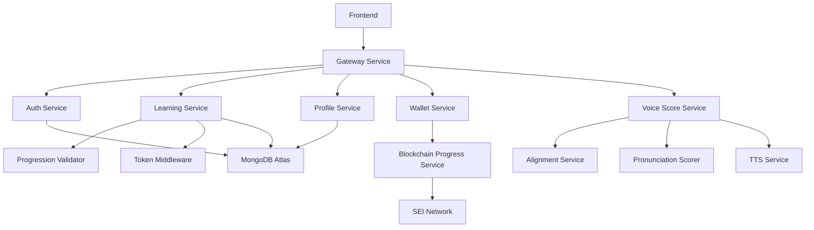

# YAP Backend Integration Guide for Frontend Developers

## Table of Contents
1. [Overview](#overview)
2. [Architecture Summary](#architecture-summary)
3. [Authentication & Security](#authentication--security)
4. [Service Integration Details](#service-integration-details)
5. [API Endpoints Reference](#api-endpoints-reference)
6. [Frontend Implementation Requirements](#frontend-implementation-requirements)
7. [Token Economy Integration](#token-economy-integration)
8. [Progression System Implementation](#progression-system-implementation)
9. [Pronunciation Assessment Integration](#pronunciation-assessment-integration)
10. [Error Handling & Best Practices](#error-handling--best-practices)
11. [Testing Environments & Endpoints](#testing-environments--endpoints)
12. [Development & Testing](#development--testing)
13. [Production Deployment](#production-deployment)

---

## Overview

The YAP backend is a comprehensive microservices architecture designed to support a sophisticated language learning platform with **CEFR-based progression (640 lessons across A1-A2 levels)**, **intelligent spaced repetition**, token economics, blockchain integration, and advanced pronunciation assessment. This guide provides frontend developers with everything needed to successfully integrate with the backend services.

### Key Features
- **CEFR Lesson System**: 640 structured lessons (A1: 1-320, A2: 321-640) with progressive difficulty
- **Spaced Repetition Algorithm**: SM-2 based intelligent vocabulary review scheduling  
- **Cross-Level Learning**: A1 vocabulary maintained while learning A2 concepts
- **Token Economy**: Earn/spend system with daily allowances and premium features
- **Blockchain Integration**: Secure wallet creation and progress recording on SEI network
- **Pronunciation Assessment**: AI-powered speech evaluation with phoneme-level feedback
- **Secure Architecture**: Zero-server-side passphrase exposure with client-side encryption

---

## Recent Enhancements (Latest)
- **Complete CEFR Implementation**: Full 640-lesson curriculum with A1 (1-320) and A2 (321-640) levels
- **Intelligent Spaced Repetition**: SM-2 algorithm automatically schedules vocabulary reviews based on performance
- **Seamless Integration**: CEFR lesson completion automatically adds vocabulary to spaced repetition system
- **Advanced Progress Tracking**: Detailed analytics on vocabulary mastery, grammar accuracy, and speaking performance
- **Adaptive Learning Flow**: Personalized recommendations based on user performance patterns

---

## Architecture Summary

### Core Services



### Service Endpoints Base URLs
```typescript
const API_ENDPOINTS = {
  AUTH: '/auth',
  LEARNING: '/learning/api',
  CEFR_LESSONS: '/learning/api/cefr',           // NEW: CEFR lesson system
  SPACED_REPETITION: '/learning/api/spaced-repetition', // NEW: Spaced repetition
  PROFILE: '/profile',
  WALLET: '/wallet',
  VOICE_SCORE: '/voice-score',                  // gRPC over HTTP
  BLOCKCHAIN_PROGRESS: '/blockchain-progress/api'
};
```

---

## Authentication & Security

### JWT Token Structure
The YAP backend uses a dual-token system for enhanced security:

```typescript
interface AuthTokens {
  accessToken: string;    // 15-minute expiry
  refreshToken: string;   // 30-day expiry
}

interface AccessTokenPayload {
  sub: string;              // userId
  iat: number;              // issued at
  type: 'access';
  currentLessonId: string;  // Current learning state
  currentWordId: string;
  nextWordAvailableAt: string;
}
```

### Authentication Flow Implementation

```typescript
class YAPAuthService {
  private tokens: AuthTokens | null = null;
  
  async secureSignup(userData: {
    email: string;
    name: string;
    language_to_learn: string;
    native_language: string;
    passphrase: string;  // Client-side only - never sent to server
  }) {
    // 1. Client-side key derivation (CRITICAL: Never send passphrase to server)
    const stretchedKey = await this.deriveStretchedKey(userData.passphrase);
    const encryptionSalt = crypto.getRandomValues(new Uint8Array(16));
    
    // 2. Encrypt stretched key for server storage
    const encryptedStretchedKey = await this.encryptForServer(stretchedKey, encryptionSalt);
    
    // 3. Generate wallet keys client-side
    const mnemonic = this.generateMnemonic();
    const { seiAddress, ethAddress } = await this.deriveAddresses(mnemonic);
    
    // 4. Encrypt mnemonic with stretched key
    const { encryptedMnemonic, mnemonicNonce } = await this.encryptMnemonic(mnemonic, stretchedKey);
    
    // 5. Send only encrypted data to server
    const response = await fetch('/auth/secure-signup', {
      method: 'POST',
      headers: { 'Content-Type': 'application/json' },
      body: JSON.stringify({
        email: userData.email,
        name: userData.name,
        language_to_learn: userData.language_to_learn,
        native_language: userData.native_language,
        
        // Encrypted data (server cannot decrypt)
        encryptedStretchedKey,
        encryptionSalt: Array.from(encryptionSalt),
        stretchedKeyNonce,
        
        // Encrypted mnemonic
        encryptedMnemonic,
        mnemonicSalt: Array.from(encryptionSalt),
        mnemonicNonce,
        
        // Public keys (safe to send)
        sei_address: seiAddress,
        sei_public_key: 'derived_from_mnemonic',
        eth_address: ethAddress,
        eth_public_key: 'derived_from_mnemonic'
      })
    });
    
    const result = await response.json();
    this.tokens = {
      accessToken: result.token,
      refreshToken: result.refreshToken
    };
    
    return result;
  }
  
  async walletAuth(credentials: {
    email: string;
    passphrase: string;
  }) {
    // 1. Derive stretched key client-side
    const stretchedKey = await this.deriveStretchedKey(credentials.passphrase);
    
    // 2. Generate authentication proof
    const authProof = await this.generateAuthProof(stretchedKey);
    
    // 3. Send authentication request
    const response = await fetch('/auth/wallet/auth', {
      method: 'POST',
      headers: { 'Content-Type': 'application/json' },
      body: JSON.stringify({
        email: credentials.email,
        authProof  // Server verifies this against stored hash
      })
    });
    
    const result = await response.json();
    
    // 4. Decrypt wallet data client-side
    const decryptedMnemonic = await this.decryptMnemonic(
      result.encryptedMnemonic,
      stretchedKey,
      result.mnemonicNonce
    );
    
    this.tokens = {
      accessToken: result.token,
      refreshToken: result.refreshToken
    };
    
    return { ...result, mnemonic: decryptedMnemonic };
  }
  
  async refreshAccessToken() {
    if (!this.tokens?.refreshToken) {
      throw new Error('No refresh token available');
    }
    
    const response = await fetch('/auth/refresh', {
      method: 'POST',
      headers: {
        'Content-Type': 'application/json',
        'Authorization': `Bearer ${this.tokens.refreshToken}`
      }
    });
    
    const result = await response.json();
    this.tokens.accessToken = result.accessToken;
    
    return result.accessToken;
  }
  
  getAuthHeaders(): Record<string, string> {
    if (!this.tokens?.accessToken) {
      throw new Error('No access token available');
    }
    
    return {
      'Authorization': `Bearer ${this.tokens.accessToken}`,
      'Content-Type': 'application/json'
    };
  }
}
```

---

## Service Integration Details

### Learning Service Integration

The Learning Service is the core of the educational experience, handling **640 CEFR-structured lessons**, **intelligent spaced repetition**, progression tracking, and daily allowances.

```typescript
class YAPLearningService {
  constructor(private auth: YAPAuthService) {}
  
  // ==========================================
  // CEFR LESSON SYSTEM (640 LESSONS)
  // ==========================================
  
  // Get specific CEFR lesson (1-640)
  async getCEFRLesson(lessonNumber: number) {
    const response = await fetch(`/learning/api/cefr/lessons/${lessonNumber}`, {
      headers: this.auth.getAuthHeaders()
    });
    
    return await response.json();
    /*
    Response structure:
    {
      lesson: {
        lessonNumber: number;        // 1-640
        level: string;              // "Foundation", "Elementary", "Pre-Intermediate", "Advanced"
        levelRange: string;         // "1-80", "81-160", "161-240", "241-320", "321-400", etc.
        theme: string;              // "First Contact", "Past Experiences", etc.
        focus: string;              // "Greetings, name, basic courtesy"
        vocabulary: {
          targetWords: string[];    // ["hola", "adiós", "por favor"]
          totalCount: { min: number; max: number };
          highFrequencyWords: string[];
        };
        grammar: {
          concepts: string[];       // ["Subject pronouns", "basic ser conjugation"]
          complexity: 'basic' | 'intermediate' | 'advanced';
          newConcepts: string[];
          reviewConcepts: string[];
        };
        speaking: {
          outputLevel: 'words' | 'phrases' | 'sentences' | 'extended';
          expectedDuration: number; // seconds
          complexity: string;
          practiceType: 'vocabulary' | 'grammar' | 'cultural' | 'free-response';
        };
        culturalFocus: boolean;
        culturalElements?: {
          topics: string[];
          comparisons: string[];
          regionalFocus?: string[];
        };
        estimatedDuration: number;  // minutes
        prerequisites: string[];    // previous lesson IDs required
        sections: Array<{
          type: 'vocabulary' | 'grammar' | 'speaking' | 'cultural' | 'review';
          title: string;
          content: string;
          estimatedTime: number;
          required: boolean;
        }>;
        assessment: {
          vocabularyMastery: number;  // Required percentage (0.7 = 70%)
          grammarAccuracy: number;
          speakingScore: number;
          culturalEngagement?: boolean;
        };
      };
      accessGranted: boolean;
      accessInfo: {
        canAccess: boolean;
        missingPrerequisites: number[];
        reason?: string;
      };
      userProgress: UserCEFRProgress | null;
      nextLesson: number | null;
      previousLesson: number | null;
    }
    */
  }
  
  // Get lessons by CEFR level
  async getLessonsByLevel(level: 'Foundation' | 'Elementary' | 'Pre-Intermediate' | 'Advanced') {
    const response = await fetch(`/learning/api/cefr/level/${level}`, {
      headers: this.auth.getAuthHeaders()
    });
    
    return await response.json();
    /*
    Response:
    {
      level: string;
      lessons: CEFRLesson[];
      totalLessons: number;
      userProgress?: {
        completedInLevel: number;
        averageScore: number;
        timeSpentInLevel: number;
      };
    }
    */
  }
  
  // Get lessons by category/theme
  async getLessonsByCategory(categoryName: string) {
    const response = await fetch(`/learning/api/cefr/category/${encodeURIComponent(categoryName)}`, {
      headers: this.auth.getAuthHeaders()
    });
    
    return await response.json();
    /*
    Response:
    {
      category: {
        categoryName: string;
        lessonRange: { start: number; end: number };
        totalLessons: number;
        level: string;
        theme: string;
        focus: string;
      };
      lessons: CEFRLesson[];
      userProgress?: CategoryProgress;
    }
    */
  }
  
  // Start a CEFR lesson
  async startCEFRLesson(lessonNumber: number) {
    const response = await fetch(`/learning/api/cefr/lessons/${lessonNumber}/start`, {
      method: 'POST',
      headers: this.auth.getAuthHeaders()
    });
    
    return await response.json();
  }
  
  // Complete a CEFR lesson (triggers spaced repetition)
  async completeCEFRLesson(lessonNumber: number, scores: {
    vocabularyScore: number;
    grammarScore: number;
    speakingScore: number;
    timeSpent: number;
    culturalEngagement?: boolean;
  }) {
    const response = await fetch(`/learning/api/cefr/lessons/${lessonNumber}/complete`, {
      method: 'POST',
      headers: this.auth.getAuthHeaders(),
      body: JSON.stringify(scores)
    });
    
    return await response.json();
    /*
    Automatically triggers:
    1. Progress update
    2. Next lesson unlock
    3. Vocabulary addition to spaced repetition
    4. Level progression check
    */
  }
  
  // Get next recommended lesson for user
  async getNextLesson(userId: string) {
    const response = await fetch(`/learning/api/cefr/user/${userId}/next`, {
      headers: this.auth.getAuthHeaders()
    });
    
    return await response.json();
  }
  
  // Get user's CEFR progress
  async getCEFRProgress(userId: string) {
    const response = await fetch(`/learning/api/cefr/progress/${userId}`, {
      headers: this.auth.getAuthHeaders()
    });
    
    return await response.json();
    /*
    Response:
    {
      userId: string;
      language: string;
      currentLesson: number;         // 1-640
      lessonsCompleted: number[];
      lessonsUnlocked: number[];
      currentLevel: string;          // "Foundation", "Elementary", etc.
      levelsCompleted: string[];
      levelProgress: {
        [level: string]: {
          lessonsCompleted: number;
          totalLessons: number;
          completionPercentage: number;
          averageScore: number;
        };
      };
      skillLevels: {
        vocabulary: {
          wordsLearned: number;
          wordsReviewed: number;
          wordsMastered: number;
          averageRetention: number;
        };
        grammar: {
          conceptsLearned: string[];
          conceptsMastered: string[];
          averageAccuracy: number;
        };
        speaking: {
          currentLevel: 'words' | 'phrases' | 'sentences' | 'extended';
          averageScore: number;
        };
        cultural: {
          topicsExplored: string[];
          comparisonsCompleted: number;
        };
      };
      timeSpent: {
        total: number;
        byLevel: { [level: string]: number };
        byCategory: { [category: string]: number };
        lastSession: Date;
      };
    }
    */
  }
  
  // ==========================================
  // SPACED REPETITION SYSTEM
  // ==========================================
  
  // Get today's vocabulary review queue
  async getDailyReviewQueue(maxItems: number = 20) {
    const response = await fetch(`/learning/api/spaced-repetition/daily-queue?maxItems=${maxItems}`, {
      headers: this.auth.getAuthHeaders()
    });
    
    return await response.json();
    /*
    Response:
    {
      queue: {
        userId: string;
        date: Date;
        language: string;
        vocabularyItems: string[];   // word IDs due for review
        grammarItems: string[];      // grammar concept IDs
        totalItems: number;
        completedItems: number;
        estimatedTime: number;       // minutes
      };
      message: string;
    }
    */
  }
  
  // Get specific items due for review
  async getReviewItems(maxItems: number = 20) {
    const response = await fetch(`/learning/api/spaced-repetition/review-items?maxItems=${maxItems}`, {
      headers: this.auth.getAuthHeaders()
    });
    
    return await response.json();
    /*
    Response:
    {
      items: Array<{
        userId: string;
        itemId: string;              // word or concept
        itemType: 'vocabulary' | 'grammar';
        firstLearned: Date;
        lastReviewed: Date;
        nextReviewDate: Date;
        repetitionInterval: number;   // days
        easeFactor: number;          // 1.3 to 2.5
        consecutiveCorrect: number;
        totalReviews: number;
        status: 'learning' | 'review' | 'mastered' | 'difficult';
        masteryLevel: number;        // 0-1
      }>;
      count: number;
    }
    */
  }
  
  // Submit review performance (updates spaced repetition schedule)
  async submitReview(itemId: string, performanceScore: number, responseTime: number = 0) {
    const response = await fetch('/learning/api/spaced-repetition/submit-review', {
      method: 'POST',
      headers: this.auth.getAuthHeaders(),
      body: JSON.stringify({
        itemId,
        performanceScore,    // 0-5 scale (0=didn't know, 5=perfect)
        responseTime,        // milliseconds
        contextUsed: 'daily-review'
      })
    });
    
    return await response.json();
    /*
    Automatically:
    1. Updates ease factor based on performance
    2. Calculates next review date using SM-2 algorithm
    3. Adjusts mastery level
    4. Marks as difficult if consistently poor performance
    */
  }
  
  // Get spaced repetition statistics
  async getSpacedRepetitionStats() {
    const response = await fetch('/learning/api/spaced-repetition/statistics', {
      headers: this.auth.getAuthHeaders()
    });
    
    return await response.json();
    /*
    Response:
    {
      statistics: {
        totalItems: number;          // Total vocabulary/grammar items
        masteredItems: number;       // Items with 80%+ mastery
        difficultItems: number;      // Items needing extra review
        reviewsDueToday: number;     // Items due for review today
        averagePerformance: number;  // 0-5 scale
        streakDays: number;          // Days with completed reviews
      };
      language: string;
      userId: string;
    }
    */
  }
  
  // Reset difficult items for re-learning
  async resetDifficultItems() {
    const response = await fetch('/learning/api/spaced-repetition/reset-difficult', {
      method: 'POST',
      headers: this.auth.getAuthHeaders()
    });
    
    return await response.json();
    /*
    Response:
    {
      success: boolean;
      message: string;
      resetCount: number;          // Number of items reset
    }
    */
  }
  
  // ==========================================
  // LEGACY ENDPOINTS (still supported)
  // ==========================================
  
  // Get user's current progression status
  async getProgressionStatus() {
    const response = await fetch('/learning/api/levels/status', {
      headers: this.auth.getAuthHeaders()
    });
    
    return await response.json();
  }
  
  // Get today's daily lesson (simplified interface)
  async getDailyLesson() {
    const response = await fetch('/learning/api/daily', {
      headers: this.auth.getAuthHeaders()
    });
    
    return await response.json();
  }
  
  // Complete daily lesson with pronunciation assessment
  async completeDailyLesson(lessonData: {
    userId: string;
    lessonId: string;
    wordId: string;
    audio?: string;  // Base64 encoded audio
    transcript?: string;
    detailLevel?: 'summary' | 'phoneme' | 'detailed';
    languageCode?: string;
  }) {
    const response = await fetch('/learning/api/daily/complete', {
      method: 'POST',
      headers: this.auth.getAuthHeaders(),
      body: JSON.stringify(lessonData)
    });
    
    return await response.json();
  }
  
  // Get token balance
  async getTokenBalance() {
    const response = await fetch('/learning/api/tokens/balance', {
      headers: this.auth.getAuthHeaders()
    });
    
    return await response.json();
  }
}
```

### Profile Service Integration

```typescript
class YAPProfileService {
  constructor(private auth: YAPAuthService) {}
  
  async getProfile(userId: string) {
    const response = await fetch(`/profile/${userId}`, {
      headers: this.auth.getAuthHeaders()
    });
    
    return await response.json();
  }
  
  async updateProfile(userId: string, updates: {
    name?: string;
    language_to_learn?: string;
    native_language?: string;
    learning_goals?: string;
    daily_lesson_reminder?: boolean;
  }) {
    const response = await fetch(`/profile/${userId}`, {
      method: 'PUT',
      headers: this.auth.getAuthHeaders(),
      body: JSON.stringify(updates)
    });
    
    return await response.json();
  }
  
  async switchLanguage(userId: string, newLanguage: string, targetLevel: string) {
    const response = await fetch('/learning/api/dynamic-lessons/switch-language', {
      method: 'POST',
      headers: this.auth.getAuthHeaders(),
      body: JSON.stringify({
        userId,
        newLanguage,
        targetLevel
      })
    });
    
    return await response.json();
  }
}
```

---

## API Endpoints Reference

### Authentication Endpoints

| Endpoint | Method | Description | Request Body | Response |
|----------|--------|-------------|--------------|----------|
| `/auth/secure-signup` | POST | Create new account with secure wallet | `SecureSignupRequest` | `AuthResponse` |
| `/auth/wallet/auth` | POST | Authenticate with wallet credentials | `WalletAuthRequest` | `AuthResponse` |
| `/auth/refresh` | POST | Refresh access token | - | `TokenResponse` |
| `/auth/logout` | POST | Revoke tokens | - | `SuccessResponse` |

### Learning Service Endpoints

| Endpoint | Method | Description | Auth | Response Type |
|----------|--------|-------------|------|---------------|
| `/learning/api/levels/status` | GET | Get progression status | Required | `ProgressionStatus` |
| `/learning/api/levels/available` | GET | Get all levels with unlock status | Required | `LevelsResponse` |
| `/learning/api/levels/{level}/unlock` | POST | Unlock level with tokens | Required | `UnlockResponse` |
| `/learning/api/lessons/{lessonId}` | GET | Get lesson with validation | Required | `LessonResponse` |
| `/learning/api/lessons` | GET | Get lessons by level | Required | `LessonsResponse` |
| `/learning/api/daily` | GET | Get daily lesson | Required | `DailyLessonResponse` |
| `/learning/api/daily/complete` | POST | Complete daily lesson | Required | `CompletionResponse` |
| `/learning/api/progress` | GET | Get user progress | Required | `ProgressResponse` |
| `/learning/api/tokens/balance` | GET | Get token balance | Required | `TokenBalanceResponse` |
| `/learning/api/tokens/spend` | POST | Spend tokens for features | Required | `SpendResponse` |

### NEW: CEFR Lesson System Endpoints

| Endpoint | Method | Description | Auth | Response Type |
|----------|--------|-------------|------|---------------|
| `/learning/api/cefr/lessons/{lessonNumber}` | GET | Get specific CEFR lesson (1-640) | Required | `CEFRLessonResponse` |
| `/learning/api/cefr/lessons/{lessonNumber}/start` | POST | Start CEFR lesson | Required | `StartResponse` |
| `/learning/api/cefr/lessons/{lessonNumber}/complete` | POST | Complete CEFR lesson | Required | `CompletionResponse` |
| `/learning/api/cefr/level/{level}` | GET | Get lessons by level | Required | `LevelLessonsResponse` |
| `/learning/api/cefr/category/{categoryName}` | GET | Get lessons by category | Required | `CategoryLessonsResponse` |
| `/learning/api/cefr/user/{userId}/next` | GET | Get next recommended lesson | Required | `NextLessonResponse` |
| `/learning/api/cefr/progress/{userId}` | GET | Get complete CEFR progress | Required | `CEFRProgressResponse` |

### NEW: Spaced Repetition System Endpoints

| Endpoint | Method | Description | Auth | Response Type |
|----------|--------|-------------|------|---------------|
| `/learning/api/spaced-repetition/daily-queue` | GET | Get today's review queue | Required | `DailyQueueResponse` |
| `/learning/api/spaced-repetition/review-items` | GET | Get items due for review | Required | `ReviewItemsResponse` |
| `/learning/api/spaced-repetition/submit-review` | POST | Submit review performance | Required | `SubmitReviewResponse` |
| `/learning/api/spaced-repetition/statistics` | GET | Get spaced repetition stats | Required | `StatisticsResponse` |
| `/learning/api/spaced-repetition/reset-difficult` | POST | Reset difficult items | Required | `ResetResponse` |

### Profile Service Endpoints

| Endpoint | Method | Description | Auth | Response Type |
|----------|--------|-------------|------|---------------|
| `/profile/{userId}` | GET | Get user profile | Required | `ProfileResponse` |
| `/profile/{userId}` | PUT | Update user profile | Required | `ProfileResponse` |
| `/profile/{userId}/wallet` | PUT | Update wallet data | Required | `SuccessResponse` |

### Pronunciation Assessment Endpoints

| Endpoint | Method | Description | Auth | Response Type |
|----------|--------|-------------|------|---------------|
| `/learning/api/daily/complete` | POST | Assess pronunciation | Required | `PronunciationResponse` |
| `/voice-score/evaluate-detailed` | gRPC | Detailed pronunciation eval | Required | `DetailedEvalResponse` |

---

## Frontend Implementation Requirements

### Required Frontend State Management

```typescript
interface AppState {
  // Authentication state
  auth: {
    isAuthenticated: boolean;
    user: UserProfile | null;
    tokens: AuthTokens | null;
  };
  
  // Learning progression state
  learning: {
    currentLevel: string;
    availableLevels: LevelStatus[];
    currentLesson: Lesson | null;
    userProgress: UserProgress;
    tokenBalance: number;
    dailyLessonsRemaining: number;
  };
  
  // Pronunciation assessment state
  pronunciation: {
    isRecording: boolean;
    currentAssessment: PronunciationResult | null;
    assessmentHistory: PronunciationAttempt[];
  };
  
  // UI state
  ui: {
    currentRoute: string;
    isLoading: boolean;
    error: string | null;
    modalStack: string[];
  };
}
```

### Core Frontend Components Required

1. **Authentication Components**
   ```typescript
   interface AuthComponents {
     SecureSignupForm: Component;     // Handles client-side encryption
     WalletAuthForm: Component;       // Handles passphrase authentication
     PassphraseValidator: Component;  // Real-time passphrase strength
     WalletSetupWizard: Component;    // Guides through secure setup
   }
   ```

2. **Learning Components**
   ```typescript
   interface LearningComponents {
     ProgressionDashboard: Component;   // Shows CEFR levels and progress
     LessonViewer: Component;          // Displays lesson content
     DailyLessonCard: Component;       // Daily lesson interface
     SkipAheadModal: Component;        // Token-based level unlocking
     TokenBalance: Component;          // Shows token count and earning opportunities
   }
   ```

3. **Pronunciation Components**
   ```typescript
   interface PronunciationComponents {
     VoiceRecorder: Component;         // Audio recording with permissions
     PronunciationFeedback: Component; // Shows detailed assessment results
     PhonemeVisualizer: Component;     // Visual phoneme-level feedback
     TTSPlayer: Component;             // Plays reference audio
   }
   ```

### Critical Frontend Requirements

#### 1. Client-Side Encryption Implementation
```typescript
// CRITICAL: All passphrase handling must be client-side only
class ClientCrypto {
  // Never send raw passphrase to server
  static async deriveStretchedKey(passphrase: string): Promise<CryptoKey> {
    const encoder = new TextEncoder();
    const passphraseBuffer = encoder.encode(passphrase);
    
    // Use PBKDF2 with 390,000 iterations (same as server validation)
    const key = await crypto.subtle.importKey(
      'raw',
      passphraseBuffer,
      'PBKDF2',
      false,
      ['deriveKey']
    );
    
    return await crypto.subtle.deriveKey(
      {
        name: 'PBKDF2',
        salt: encoder.encode('x0xmbtbles0x' + passphrase),
        iterations: 390000,
        hash: 'SHA-256'
      },
      key,
      { name: 'AES-GCM', length: 256 },
      false,
      ['encrypt', 'decrypt']
    );
  }
  
  static async encryptMnemonic(mnemonic: string, key: CryptoKey): Promise<{
    encryptedMnemonic: string;
    nonce: Uint8Array;
  }> {
    const encoder = new TextEncoder();
    const mnemonicBuffer = encoder.encode(mnemonic);
    const nonce = crypto.getRandomValues(new Uint8Array(12));
    
    const encrypted = await crypto.subtle.encrypt(
      { name: 'AES-GCM', iv: nonce },
      key,
      mnemonicBuffer
    );
    
    return {
      encryptedMnemonic: btoa(String.fromCharCode(...new Uint8Array(encrypted))),
      nonce
    };
  }
}
```

#### 2. Token Balance Monitoring
```typescript
class TokenBalanceManager {
  private balance: number = 0;
  private callbacks: Array<(balance: number) => void> = [];
  
  async updateBalance() {
    const response = await fetch('/learning/api/tokens/balance', {
      headers: auth.getAuthHeaders()
    });
    const data = await response.json();
    
    this.balance = data.balance;
    this.callbacks.forEach(cb => cb(this.balance));
  }
  
  canAfford(cost: number): boolean {
    return this.balance >= cost;
  }
  
  subscribe(callback: (balance: number) => void) {
    this.callbacks.push(callback);
    callback(this.balance); // Immediate update
  }
}
```

#### 3. Progression Validation
```typescript
class ProgressionManager {
  async validateLevelAccess(level: string): Promise<{
    canAccess: boolean;
    requiresTokens: boolean;
    tokenCost: number;
    missingPrerequisites: string[];
  }> {
    const response = await fetch(`/learning/api/levels/${level}/requirements`, {
      headers: auth.getAuthHeaders()
    });
    
    return await response.json();
  }
  
  async attemptLevelUnlock(level: string): Promise<boolean> {
    try {
      await fetch(`/learning/api/levels/${level}/unlock`, {
        method: 'POST',
        headers: auth.getAuthHeaders(),
        body: JSON.stringify({ skipAhead: true })
      });
      
      return true;
    } catch (error) {
      console.error('Level unlock failed:', error);
      return false;
    }
  }
}
```

---

## CEFR Lesson Flow with Spaced Repetition Integration

This section provides a complete example of how to implement the CEFR lesson system with integrated spaced repetition for optimal learning outcomes.

### Complete Learning Session Flow

```typescript
class CEFRLearningSession {
  private auth: YAPAuthService;
  private learningService: YAPLearningService;
  
  constructor(auth: YAPAuthService) {
    this.auth = auth;
    this.learningService = new YAPLearningService(auth);
  }
  
  // 1. Start a complete learning session
  async startLearningSession(userId: string): Promise<{
    cefrLesson: CEFRLesson;
    reviewQueue: SpacedRepetitionQueue;
    sessionPlan: SessionPlan;
  }> {
    // Get user's progress and next lesson
    const [progress, nextLesson, reviewQueue] = await Promise.all([
      this.learningService.getCEFRProgress(userId),
      this.learningService.getNextLesson(userId),
      this.learningService.getDailyReviewQueue(15) // 15 review items
    ]);
    
    if (!nextLesson) {
      throw new Error('No lessons available - course may be complete');
    }
    
    // Create optimized session plan
    const sessionPlan: SessionPlan = {
      startWithReview: reviewQueue.queue.totalItems > 0,
      reviewTime: Math.min(reviewQueue.queue.totalItems * 30, 300), // 30s per item, max 5 min
      lessonTime: nextLesson.estimatedDuration * 60, // Convert to seconds
      totalTime: 0,
      reviewItems: reviewQueue.queue.vocabularyItems.slice(0, 5), // Start with 5 items
      newLesson: nextLesson,
      recommendedBreaks: []
    };
    
    sessionPlan.totalTime = sessionPlan.reviewTime + sessionPlan.lessonTime;
    sessionPlan.recommendedBreaks = this.calculateBreaks(sessionPlan.totalTime);
    
    return {
      cefrLesson: nextLesson,
      reviewQueue: reviewQueue.queue,
      sessionPlan
    };
  }
  
  // 2. Complete review session before lesson
  async completeReviewSession(reviewItems: string[]): Promise<ReviewSessionResult> {
    const results: ReviewResult[] = [];
    
    for (const itemId of reviewItems) {
      // Present item to user, get their response
      const userResponse = await this.presentReviewItem(itemId);
      
      // Submit performance score (0-5 scale)
      const performance = await this.learningService.submitReview(
        itemId,
        userResponse.performanceScore,
        userResponse.responseTime
      );
      
      results.push({
        itemId,
        performance: userResponse.performanceScore,
        correct: userResponse.performanceScore >= 3,
        responseTime: userResponse.responseTime,
        nextReview: performance.nextReviewDate
      });
    }
    
    return {
      totalItems: results.length,
      correctAnswers: results.filter(r => r.correct).length,
      averageTime: results.reduce((sum, r) => sum + r.responseTime, 0) / results.length,
      masteryGained: results.filter(r => r.performance >= 4).length,
      needsMoreWork: results.filter(r => r.performance < 2).length,
      results
    };
  }
  
  // 3. Complete CEFR lesson with automatic spaced repetition integration
  async completeCEFRLesson(
    lessonNumber: number,
    lessonScores: {
      vocabularyScore: number;
      grammarScore: number;
      speakingScore: number;
      timeSpent: number;
      culturalEngagement?: boolean;
    }
  ): Promise<LessonCompletionResult> {
    // Start the lesson
    await this.learningService.startCEFRLesson(lessonNumber);
    
    // Complete the lesson (automatically adds vocab to spaced repetition)
    const completionResult = await this.learningService.completeCEFRLesson(
      lessonNumber,
      lessonScores
    );
    
    // Get updated progress
    const [updatedProgress, nextLesson] = await Promise.all([
      this.learningService.getCEFRProgress(completionResult.userId),
      this.learningService.getNextLesson(completionResult.userId)
    ]);
    
    return {
      ...completionResult,
      progress: updatedProgress,
      nextLesson,
      newVocabularyAdded: completionResult.vocabularyAddedToSpacedRepetition || [],
      achievements: this.calculateAchievements(lessonNumber, updatedProgress),
      recommendedNextAction: this.getRecommendedNextAction(updatedProgress, nextLesson)
    };
  }
  
  // 4. Get personalized learning recommendations
  async getPersonalizedRecommendations(userId: string): Promise<LearningRecommendations> {
    const [progress, reviewStats, tokenBalance] = await Promise.all([
      this.learningService.getCEFRProgress(userId),
      this.learningService.getSpacedRepetitionStats(),
      this.learningService.getTokenBalance()
    ]);
    
    const recommendations: LearningRecommendations = {
      primaryAction: 'continue-lessons',
      urgentReviews: reviewStats.statistics.reviewsDueToday,
      strengths: [],
      needsWork: [],
      suggestions: [],
      timeRecommendation: 'balanced' // 'review-focused' | 'lesson-focused' | 'balanced'
    };
    
    // Analyze user's performance patterns
    if (reviewStats.statistics.difficultItems > 10) {
      recommendations.needsWork.push('vocabulary-retention');
      recommendations.suggestions.push('Spend more time on spaced repetition reviews');
      recommendations.timeRecommendation = 'review-focused';
    }
    
    if (progress.skillLevels.speaking.averageScore < 0.7) {
      recommendations.needsWork.push('pronunciation');
      recommendations.suggestions.push('Use detailed pronunciation assessment');
    }
    
    if (progress.skillLevels.grammar.averageAccuracy > 0.85) {
      recommendations.strengths.push('grammar-mastery');
    }
    
    if (reviewStats.statistics.reviewsDueToday > 0) {
      recommendations.primaryAction = 'complete-reviews';
      recommendations.suggestions.unshift(`Complete ${reviewStats.statistics.reviewsDueToday} pending reviews`);
    }
    
    return recommendations;
  }
  
  // 5. Adaptive difficulty adjustment
  async adjustDifficultyBasedOnPerformance(
    userId: string,
    recentPerformance: PerformanceMetrics
  ): Promise<DifficultyAdjustment> {
    const progress = await this.learningService.getCEFRProgress(userId);
    
    // Analyze recent performance
    const averageAccuracy = (
      recentPerformance.vocabularyAccuracy +
      recentPerformance.grammarAccuracy +
      recentPerformance.speakingAccuracy
    ) / 3;
    
    const difficultyAdjustment: DifficultyAdjustment = {
      currentDifficulty: 'normal',
      recommendedDifficulty: 'normal',
      adjustmentReason: '',
      specificAdjustments: {}
    };
    
    if (averageAccuracy > 0.9) {
      difficultyAdjustment.recommendedDifficulty = 'challenging';
      difficultyAdjustment.adjustmentReason = 'Consistently high performance';
      difficultyAdjustment.specificAdjustments = {
        vocabularyComplexity: 'increase',
        grammarIntroductionRate: 'accelerate',
        speakingRequirements: 'extend'
      };
    } else if (averageAccuracy < 0.6) {
      difficultyAdjustment.recommendedDifficulty = 'simplified';
      difficultyAdjustment.adjustmentReason = 'Struggling with current pace';
      difficultyAdjustment.specificAdjustments = {
        vocabularyComplexity: 'decrease',
        grammarIntroductionRate: 'slow',
        speakingRequirements: 'simplify'
      };
    }
    
    return difficultyAdjustment;
  }
  
  // Helper methods
  private calculateBreaks(totalTimeSeconds: number): number[] {
    const breaks: number[] = [];
    const breakInterval = 15 * 60; // 15 minutes
    
    for (let time = breakInterval; time < totalTimeSeconds; time += breakInterval) {
      breaks.push(time);
    }
    
    return breaks;
  }
  
  private calculateAchievements(lessonNumber: number, progress: UserCEFRProgress): string[] {
    const achievements: string[] = [];
    
    // Milestone achievements
    if (lessonNumber === 80) achievements.push('Foundation Level Complete');
    if (lessonNumber === 160) achievements.push('Elementary Level Complete');
    if (lessonNumber === 240) achievements.push('Pre-Intermediate Level Complete');
    if (lessonNumber === 320) achievements.push('Spanish A1 Course Complete');
    if (lessonNumber === 400) achievements.push('A2 Foundation Level Complete');
    if (lessonNumber === 480) achievements.push('A2 Elementary Level Complete');
    if (lessonNumber === 560) achievements.push('A2 Pre-Intermediate Level Complete');
    if (lessonNumber === 640) achievements.push('Spanish A2 Course Complete - Full A1-A2 Mastery!');
    
    // Streak achievements
    if (progress.timeSpent.lastSession && this.isConsecutiveDay(progress.timeSpent.lastSession)) {
      const streakDays = this.calculateStreakDays(progress);
      if (streakDays >= 7) achievements.push(`${streakDays} Day Learning Streak!`);
    }
    
    // Skill achievements
    if (progress.skillLevels.vocabulary.wordsMastered >= 100) {
      achievements.push('Vocabulary Master - 100 Words');
    }
    
    if (progress.skillLevels.speaking.averageScore >= 0.9) {
      achievements.push('Pronunciation Expert');
    }
    
    return achievements;
  }
  
  private getRecommendedNextAction(
    progress: UserCEFRProgress,
    nextLesson: CEFRLesson | null
  ): RecommendedAction {
    if (!nextLesson) {
      return {
        type: 'course-complete',
        description: 'Congratulations! You have completed the course.',
        actionLabel: 'View Certificate',
        priority: 'high'
      };
    }
    
    // Check if user has pending reviews
    if (progress.skillLevels.vocabulary.wordsReviewed < progress.skillLevels.vocabulary.wordsLearned * 0.8) {
      return {
        type: 'review-focus',
        description: 'Complete vocabulary reviews to strengthen retention.',
        actionLabel: 'Start Review Session',
        priority: 'high'
      };
    }
    
    return {
      type: 'continue-lessons',
      description: `Continue to lesson ${nextLesson.lessonNumber}: ${nextLesson.theme}`,
      actionLabel: 'Start Lesson',
      priority: 'medium'
    };
  }
  
  private async presentReviewItem(itemId: string): Promise<{
    performanceScore: number;
    responseTime: number;
  }> {
    // This would be implemented by the frontend UI
    // Return mock data for now
    return {
      performanceScore: Math.floor(Math.random() * 6), // 0-5 scale
      responseTime: Math.floor(Math.random() * 5000) + 1000 // 1-6 seconds
    };
  }
  
  private isConsecutiveDay(lastSession: Date): boolean {
    const today = new Date();
    const yesterday = new Date(today.getTime() - 24 * 60 * 60 * 1000);
    return lastSession >= yesterday;
  }
  
  private calculateStreakDays(progress: UserCEFRProgress): number {
    // This would analyze the user's session history
    // Return mock data for now
    return 5;
  }
}

// Supporting interfaces
interface SessionPlan {
  startWithReview: boolean;
  reviewTime: number;
  lessonTime: number;
  totalTime: number;
  reviewItems: string[];
  newLesson: CEFRLesson;
  recommendedBreaks: number[];
}

interface ReviewResult {
  itemId: string;
  performance: number;
  correct: boolean;
  responseTime: number;
  nextReview: Date;
}

interface ReviewSessionResult {
  totalItems: number;
  correctAnswers: number;
  averageTime: number;
  masteryGained: number;
  needsMoreWork: number;
  results: ReviewResult[];
}

interface LearningRecommendations {
  primaryAction: 'continue-lessons' | 'complete-reviews' | 'review-difficult';
  urgentReviews: number;
  strengths: string[];
  needsWork: string[];
  suggestions: string[];
  timeRecommendation: 'review-focused' | 'lesson-focused' | 'balanced';
}

interface PerformanceMetrics {
  vocabularyAccuracy: number;
  grammarAccuracy: number;
  speakingAccuracy: number;
  averageSessionTime: number;
  consistencyScore: number;
}

interface DifficultyAdjustment {
  currentDifficulty: 'simplified' | 'normal' | 'challenging';
  recommendedDifficulty: 'simplified' | 'normal' | 'challenging';
  adjustmentReason: string;
  specificAdjustments: {
    vocabularyComplexity?: 'decrease' | 'maintain' | 'increase';
    grammarIntroductionRate?: 'slow' | 'normal' | 'accelerate';
    speakingRequirements?: 'simplify' | 'maintain' | 'extend';
  };
}

interface RecommendedAction {
  type: 'continue-lessons' | 'review-focus' | 'course-complete';
  description: string;
  actionLabel: string;
  priority: 'low' | 'medium' | 'high';
}
```

### Frontend Component Integration Example

```typescript
const CEFRLearningPage: React.FC = () => {
  const [session, setSession] = useState<CEFRLearningSession | null>(null);
  const [currentPhase, setCurrentPhase] = useState<'loading' | 'review' | 'lesson' | 'complete'>('loading');
  const [reviewResults, setReviewResults] = useState<ReviewSessionResult | null>(null);
  const [lessonCompletion, setLessonCompletion] = useState<LessonCompletionResult | null>(null);
  const [recommendations, setRecommendations] = useState<LearningRecommendations | null>(null);
  
  const userId = useAuth().user?.id;
  const learningSession = useRef(new CEFRLearningSession(auth));
  
  useEffect(() => {
    if (userId) {
      initializeLearningSession();
    }
  }, [userId]);
  
  const initializeLearningSession = async () => {
    try {
      const sessionData = await learningSession.current.startLearningSession(userId!);
      setSession(sessionData);
      
      // Get personalized recommendations
      const recs = await learningSession.current.getPersonalizedRecommendations(userId!);
      setRecommendations(recs);
      
      // Decide starting phase based on recommendations
      if (recs.primaryAction === 'complete-reviews' && sessionData.reviewQueue.totalItems > 0) {
        setCurrentPhase('review');
      } else {
        setCurrentPhase('lesson');
      }
    } catch (error) {
      console.error('Failed to initialize learning session:', error);
    }
  };
  
  const handleReviewComplete = async (results: ReviewSessionResult) => {
    setReviewResults(results);
    setCurrentPhase('lesson');
  };
  
  const handleLessonComplete = async (scores: LessonScores) => {
    try {
      const completion = await learningSession.current.completeCEFRLesson(
        session!.cefrLesson.lessonNumber,
        scores
      );
      
      setLessonCompletion(completion);
      setCurrentPhase('complete');
    } catch (error) {
      console.error('Failed to complete lesson:', error);
    }
  };
  
  if (currentPhase === 'loading') {
    return <div>Loading your personalized learning session...</div>;
  }
  
  return (
    <div className="cefr-learning-page">
      <SessionHeader session={session} recommendations={recommendations} />
      
      {currentPhase === 'review' && (
        <SpacedRepetitionReview
          reviewQueue={session!.reviewQueue}
          onComplete={handleReviewComplete}
        />
      )}
      
      {currentPhase === 'lesson' && (
        <CEFRLessonView
          lesson={session!.cefrLesson}
          reviewResults={reviewResults}
          onComplete={handleLessonComplete}
        />
      )}
      
      {currentPhase === 'complete' && (
        <LessonCompletionView
          completion={lessonCompletion!}
          recommendations={recommendations}
          onContinue={() => window.location.reload()}
        />
      )}
    </div>
  );
};
```

This integration provides:

1. **Seamless Review-to-Lesson Flow**: Users complete spaced repetition reviews before starting new lessons
2. **Automatic Vocabulary Integration**: New lesson vocabulary is automatically added to spaced repetition
3. **Personalized Recommendations**: AI-driven suggestions based on user performance
4. **Adaptive Difficulty**: Automatic adjustment based on user success rates
5. **Achievement System**: Milestone tracking and celebration
6. **Optimal Session Planning**: Balanced review and learning time allocation

---

## Testing Environments & Endpoints

### 🌐 Available Testing Domains

The YAP backend provides multiple environments for frontend development and testing:

#### **Production Environment**
- **Domain**: `https://app.goyap.ai`
- **Purpose**: Live production environment
- **SSL**: ✅ Valid SSL certificates
- **Use Case**: Final testing before release, production debugging

#### **Testing Environment**
- **Domain**: `https://delta-sandbox-7k3m.goyap.ai`
- **Purpose**: Secure testing environment (non-guessable subdomain)
- **SSL**: ✅ Valid SSL certificates
- **Use Case**: Feature testing, integration testing, safe experimentation

#### **Local Development**
- **Domain**: `http://localhost:3000` (typical frontend dev server)
- **Backend**: Connect to testing environment or local backend
- **CORS**: Pre-configured for localhost development

### 🚀 Quick Testing Setup

```typescript
// Frontend environment configuration
const API_CONFIG = {
  // Production
  production: {
    baseURL: 'https://app.goyap.ai',
    timeout: 10000,
    retries: 3
  },
  
  // Testing/Staging
  testing: {
    baseURL: 'https://delta-sandbox-7k3m.goyap.ai',
    timeout: 15000,
    retries: 2
  },
  
  // Local development
  development: {
    baseURL: 'https://delta-sandbox-7k3m.goyap.ai', // Use testing backend
    timeout: 20000,
    retries: 1
  }
};

// Auto-detect environment
const getCurrentConfig = () => {
  if (process.env.NODE_ENV === 'production') return API_CONFIG.production;
  if (process.env.NODE_ENV === 'development') return API_CONFIG.development;
  return API_CONFIG.testing;
};
```

### 🧪 API Endpoint Testing

#### **Health Check Endpoints**
Test basic connectivity with these endpoints:

```bash
# Production health check
curl -I https://app.goyap.ai/api/auth/healthz

# Testing environment health check
curl -I https://delta-sandbox-7k3m.goyap.ai/api/auth/healthz

# Learning service health
curl -I https://app.goyap.ai/api/learning/health
```

#### **Authentication Testing**
```javascript
// Test authentication endpoints
const testAuth = async () => {
  const baseURL = getCurrentConfig().baseURL;
  
  // Test signup endpoint
  const signupResponse = await fetch(`${baseURL}/api/auth/secure-signup`, {
    method: 'POST',
    headers: { 'Content-Type': 'application/json' },
    body: JSON.stringify({
      email: 'test@example.com',
      name: 'Test User',
      // ... other required fields
    })
  });
  
  console.log('Signup test:', signupResponse.status);
  
  // Test login endpoint
  const loginResponse = await fetch(`${baseURL}/api/auth/wallet/auth`, {
    method: 'POST',
    headers: { 'Content-Type': 'application/json' },
    body: JSON.stringify({
      email: 'test@example.com',
      authProof: 'generated_proof'
    })
  });
  
  console.log('Login test:', loginResponse.status);
};
```

#### **Learning API Testing**
```javascript
// Test CEFR lesson system
const testCEFRAPI = async (authToken) => {
  const baseURL = getCurrentConfig().baseURL;
  const headers = {
    'Authorization': `Bearer ${authToken}`,
    'Content-Type': 'application/json'
  };
  
  // Test lesson retrieval
  const lessonResponse = await fetch(`${baseURL}/api/learning/cefr/lessons/1`, {
    headers
  });
  console.log('CEFR Lesson 1:', lessonResponse.status);
  
  // Test user progress
  const progressResponse = await fetch(`${baseURL}/api/learning/cefr/progress/user123`, {
    headers
  });
  console.log('User progress:', progressResponse.status);
  
  // Test spaced repetition
  const reviewResponse = await fetch(`${baseURL}/api/learning/spaced-repetition/daily-queue`, {
    headers
  });
  console.log('Review queue:', reviewResponse.status);
};
```

### 🔧 Development Workflow

#### **Recommended Testing Flow**
1. **Local Development**: Develop against testing environment
2. **Feature Testing**: Test on testing environment
3. **Integration Testing**: Test on testing environment with full flow
4. **Pre-production**: Final testing on production environment
5. **Production**: Deploy to production

#### **CORS Configuration**
Both environments support these origins:
- `https://app.goyap.ai` (production)
- `https://delta-sandbox-7k3m.goyap.ai` (testing)
- `http://localhost:3000` (local development)
- `http://localhost:8100` (Ionic dev server)
- `http://localhost:5173` (Vite dev server)

### 📊 Testing Checklist

Before deploying to production, verify:

#### **Authentication Flow**
- [ ] User registration works
- [ ] User login works
- [ ] Token refresh works
- [ ] Secure logout works
- [ ] Passphrase handling is client-side only

#### **Learning System**
- [ ] CEFR lessons load correctly (test lesson 1)
- [ ] Lesson progression works
- [ ] Spaced repetition queue loads
- [ ] Review submission works
- [ ] Progress tracking updates

#### **Voice/Pronunciation**
- [ ] Audio recording works
- [ ] Pronunciation assessment returns scores
- [ ] TTS audio playback works
- [ ] Detailed feedback displays correctly

#### **Error Handling**
- [ ] Network errors handled gracefully
- [ ] Authentication errors redirect to login
- [ ] API errors display user-friendly messages
- [ ] Offline state handled appropriately

### 🐛 Common Testing Issues

#### **CORS Errors**
```javascript
// If you get CORS errors, check:
// 1. Are you using the correct domain?
// 2. Is your local server running on an allowed port?
// 3. Are you sending the correct headers?

// Example fix:
const corsHeaders = {
  'Origin': 'http://localhost:3000',
  'Content-Type': 'application/json',
  'Authorization': `Bearer ${token}`
};
```

#### **SSL Certificate Issues**
```bash
# If SSL certificates fail (unlikely):
# 1. Check domain spelling
# 2. Verify certificates are valid
# 3. Try HTTP endpoints temporarily (not recommended)

# Check certificate validity:
openssl s_client -connect app.goyap.ai:443 -servername app.goyap.ai
```

#### **Authentication Token Issues**
```javascript
// Token refresh handling:
const apiCall = async (url, options = {}) => {
  let response = await fetch(url, {
    ...options,
    headers: {
      'Authorization': `Bearer ${accessToken}`,
      ...options.headers
    }
  });
  
  // Handle token expiration
  if (response.status === 401) {
    await refreshToken();
    response = await fetch(url, {
      ...options,
      headers: {
        'Authorization': `Bearer ${newAccessToken}`,
        ...options.headers
      }
    });
  }
  
  return response;
};
```

### 📞 Support & Resources

#### **Documentation**
- **API Reference**: See [API Endpoints Reference](#api-endpoints-reference) section
- **Authentication**: See [Authentication & Security](#authentication--security) section
- **DNS Configuration**: `/docs/dns-configuration-guide.md`
- **SSL Setup**: `/docs/ingress-dns-ssl-setup-guide.md`

#### **Getting Help**
- **Backend Issues**: Check service logs and health endpoints
- **Frontend Issues**: Verify CORS and authentication setup
- **Network Issues**: Test with curl commands first
- **SSL Issues**: Check certificate validity and domain configuration

---
